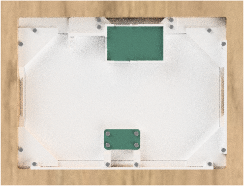

# ePaper frame for ESPhome

A 3D Printed picture frame for ESP32 to be used e.g. with ESPhome for home assistant 





## Introduction

A 3D printed picture frame, built with ESP32/ESPhome:

- A robust structure
- can be used in portrait and landscape mode
- home assistant integration
- Example code

## Electronics

| Name                       | Thumbnail                                                                | Required          | Note      |
| -------------------------- | ------------------------------------------------------------------------ | ----------------- | --------- |
| ESP32 Dev Module |  | 1 | Easiest way is to use pre-assembled display boards such as [this one](https://www.waveshare.com/wiki/E-Paper_ESP32_Driver_Board) |
| 7,5" ePaper Display HAT |  | 1 | There a dozens of different epaper displays available which require different configuration. I used [this one](https://www.waveshare.com/7.5inch-e-Paper-B.htm) |

*Please note that this hat has no PSRAM as most other ESP32 development boards and is therefore limited in terms of use for memory intesive graphic operations (downloading images from the web, decoding images at runtime etc) 

### ESP pinout to ePaper

If you use the out-of-the-box solution from waveshare mentioned above, this is a working configuration and pinout for the display:
- Display model 50inV2alt
- SPI CLK: GPIO13
- SPI MOSI: GPIO14
- CS: GPIO15
- DC: GPIO27
- RESET: GPIO26 (Reset duration 2ms)
- BUSY: GPIO25 (Inverted!)
  

### Connection Diagram

If you are using the preassembled component mentioned above, there is no need for any further wiring. Just connect the flat wire of the display to the hat and you are good to go. For further details see waveshare's wiki: https://www.waveshare.com/wiki/7.5inch_e-Paper_HAT_(B)_Manual#ESP32.2F8266


## Assembly


Note that you can insert the ESP in its mount facing upside down in case you want to access the GPIO pins that would otherwise be on the backside.
Also you can mount the ESP box facing the cable holder in the other direction than shown in the assembly video if this allows you for better mounting of the cable in you home.  

### 3D-Printed Parts

| Filename       | Thumbnail                                                                                   | Required |
| -------------- | ------------------------------------------------------------------------------------------- | -------- |
| frame             |                          | 1        |
| display_backplate |  | 1        |
| esp_box           |                      | 1        |
| display_cable_box |  | 1        |
| short_grid        |                | optional, required for wall hanging in portrait mode |
| long_grid         |                  | option, required for wall hanging in landscape mode |

#### Required screws

| Name      | Spec    | Required |
| --------- | ------- | -------- |
| Screw     | M2 6mm  | 4        |
| Screw     | M2 10mm | 14       |

## ESP home yaml


Source code is under `./src_esphome` and is separated into packages in `./src_esphome/packages`

- `epaper_display.yaml`: main file for ESP home configuration
- `packages/device_basics.yaml`: Basic and hardware related configuration for ESP home. No business logic
- `packages/standard_fonts.yaml`: Loads required fonts and glyphs/icons 


## home assistant configuration

In the example we use weather data provided which need to be provided in a suitable format to sensors in ESP home devices. 
For this, we need to modify configuration.yaml in order to query data and feed it into the right format in entities.

Source code is under `./src_homeassistant`.

- `epaper_package.yaml`: Extensions to configuration.yaml. Provided as separate package. 

Can to be included in configuration via import directive (e.g. ```packages: !include_dir_named packages```)

