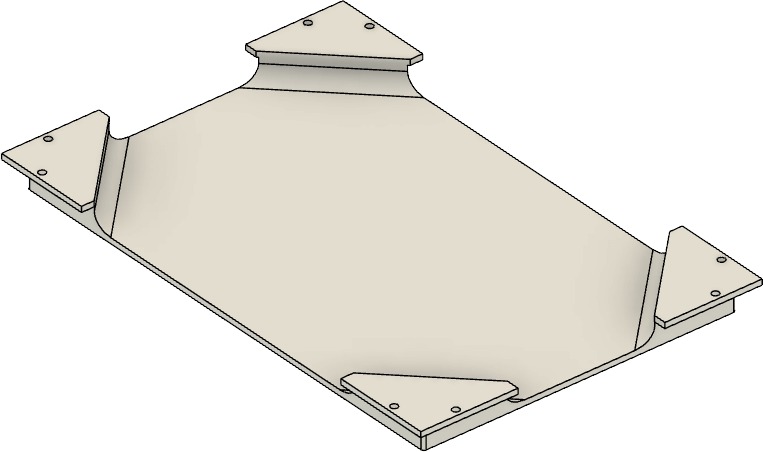
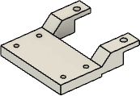

# ePaper frame for ESPhome

A 3D Printed picture frame for ESP32 to be used e.g. with ESPhome for home assistant 

## Introduction

A 3D printed picture frame, built with ESP32/ESPhome:

- A robust structure
- home assistant integration
- Example code

## Electronics

| Name                       | Thumbnail                                                                | Required          | Note      |
| -------------------------- | ------------------------------------------------------------------------ | ----------------- | --------- |
| ESP32 Dev Module           |                   | 1                 |           |
| 7,5" ePaper Display HAT    |   | 1                 |           |

### Connection Diagram

See waveshare's wiki: https://www.waveshare.com/wiki/7.5inch_e-Paper_HAT_(B)_Manual#ESP32.2F8266

## Assembly

### 3D-Printed Parts

| Filename       | Thumbnail                                                                                   | Required |
| -------------- | ------------------------------------------------------------------------------------------- | -------- |
| frame             |                          | 1        |
| display_backplate |  | 1        |
| esp_box           |                      | 1        |
| display_cable_box |  | 1        |
| short_grid        |                | optional, required for wall hanging in portrait mode |
| long_grid         |                  | option, required for wall hanging in landscape mode |

#### Required screws

| Name      | Spec    | Required |
| --------- | ------- | -------- |
| Screw     | M2 6mm  | 4        |
| Screw     | M2 10mm | 14       |

## ESP home yaml

TBD

## home assistant configuration

TBD

