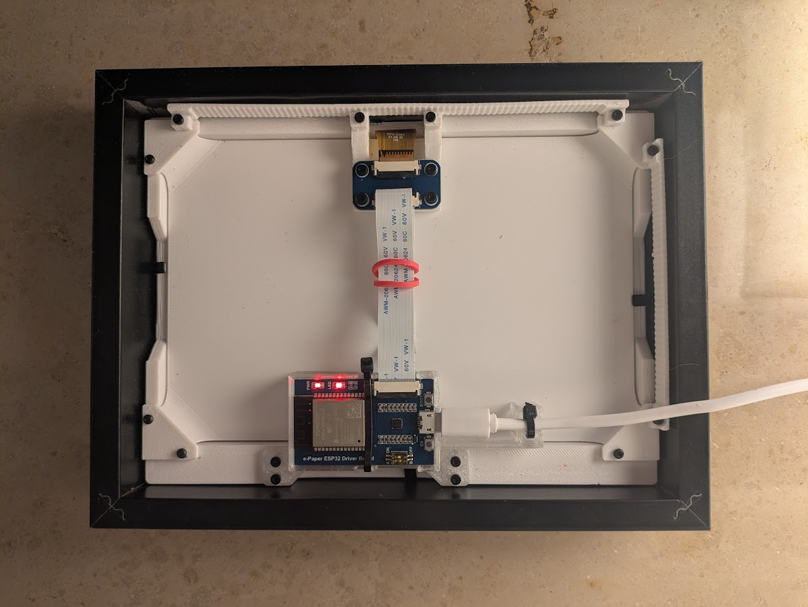

# ePaper frame for ESP32

[](#)
[](#)
[](#)

A 3D printed picture frame that shows unique pictures every day, built with ESP32/ESPhome:

- A robust 3D printed structure fitting into a regular 13x18cm IKEA picture frame (e.g. RÖDALM)
- can be used in portrait and landscape mode
- home assistant integration for flexible usage
- Example code (e.g. AI image generator)
- Power saving due to ESP32 deep sleep support


# Index
- [Mechanics](#Mechanics)
- [Electronics](#Electronics)
- [Usage: ESP home integration](#esp-home-integration)
- [Usage: home assistant automation](#home-assistant-automation)
- [Usage: AI generated image](#ai-image-generator-script)
- [Usage: Lorem picsum random picture](#lorem-picsum-picture)
- [Usage: Wallhaven picture of the day](#wallhaven-picture-of-the-day)
- [Acknowledgements](#Acknowledgements)


## Mechanics

A 3D Printed picture frame for ESP32 to be used e.g. with ESPhome for home assistant 

Renderings / Prototype:
| Front                                                | Back                                                 | Isometric |
| ---------------------------------------------------- | ---------------------------------------------------- | --------- |
|  |    |  |
|     |       |  |


### 3D-Printed Parts

| Filename       | Thumbnail                                                                       | Required |
| -------------- | ------------------------------------------------------------------------------- | -------- |
| frame_lower_clips, frame_higher_clips |                          | 1        |
| display_backplate |  | 1        |
| esp_box           |                      | 1        |
| display_cable_box |  | 1        |
| short_grid        |                | optional, required for wall hanging in portrait mode |
| long_grid         |                  | option, required for wall hanging in landscape mode |


> **Note on IKEA picture frames:**  
> IKEA has changed the position of the wire clips on the back of their picture frames in newer batches ([see Issue #1](https://github.com/Smengerl/ePaper_frame/issues/1)).  
> Please check the position of the wire clips on your frame before printing.  
> Depending on the position, you should print either the `frame_lower_clips` **or** `frame_higher_clips` version.


### Required screws

| Name      | Spec    | Required |
| --------- | ------- | -------- |
| Screw     | M2 6mm  | 4        |
| Screw     | M2 10mm | 14       |

### Assembly


Note that you can insert the ESP in its mount facing upside down in case you want to access the GPIO pins that would otherwise be on the backside.
Also you can mount the ESP box facing the cable holder in the other direction than shown in the assembly video if this allows you for better mounting of the cable in you home.  


## Electronics

### Part list

| Unit price | Quantity | Partname | Thumbnail | Note |
| ---------- | -------- | -------- | --------- | ---- |
| 5-10 USD | 1 | ESP32 Dev Module |  | Easiest way is to use pre-assembled display boards such as [this one](https://www.waveshare.com/wiki/E-Paper_ESP32_Driver_Board) |
| 50 USD | 1 | 7,5" ePaper Display HAT |  | There a dozens of different epaper displays available which require different configuration. I used [this one](https://www.waveshare.com/7.5inch-e-Paper-B.htm) |

*Please note that this hat has no PSRAM as most other ESP32 development boards and is therefore limited in terms of use for memory intesive graphic operations (downloading images from the web, decoding images at runtime etc) 

### Schematics

If you use the out-of-the-box solution from waveshare mentioned above, this is a working configuration and pinout for the display:
- Display model 50inV2alt
- SPI CLK: GPIO13
- SPI MOSI: GPIO14
- CS: GPIO15
- DC: GPIO27
- RESET: GPIO26 (Reset duration 2ms)
- BUSY: GPIO25 (Inverted!)

If you are using the preassembled component mentioned above, there is no need for any further wiring. Just connect the flat wire of the display to the hat and you are good to go. For further details see waveshare's wiki: https://www.waveshare.com/wiki/7.5inch_e-Paper_HAT_(B)_Manual#ESP32.2F8266


## Usage

The following examples uses the epaper picture in conjunction with ESP home showing a different picture every day or on certain triggers via home assistant. 

The approach is based on integerating the ePaper frame as a device in ESPhome.
An automation and helper scripts are used in homeassistant to generate suitable images on a certain time interval or other triggers.
In the meanwhile the ESP is set to deep sleep mode to preserve energy.


### ESP home integration

This ESPHome project configures an ePaper display as a smart and energy-efficient solution for displaying dynamic content, such as images fetched from Home Assistant. It leverages deep sleep capabilities to optimize power usage and supports features like manual refresh, automatic updates, and offline fallback modes.

Features
- Dynamic Image Display: Displays images fetched from a given URL (default: from Home Assistant local directory). Supports resizing and rendering PNG images directly on the ePaper display.
- Support for automations: Exposes actions (e.g., reload image, render) that can be used in HA automations. Actions can be used asynchronously (default) and also synchronously via waiting for callback events, see example below   
- Deep Sleep Optimization: Offers deep sleep to reduce power consumption. Can be manually woken up via boot button. Event callback to trigger subsequent automations. 
- Automatic and Manual Refresh: Option for automatic display refresh of the ePaper display at specified intervals as well as full control via manual refresh
- Offline Fallback: Displays a local "offline" image when Wi-Fi or image download fails.
- HA GUI support: Debug and configuration entities are provided in device settings in HA


Source code is under `./esphome_src`

- `/epaper_display.yaml`: main file for ESP home configuration, contains the relevant source code, imports all following packages
- `/epaper_display_packages/device_basics.yaml`: Basic hardware related configuration for ESP and display, no logic
- `/shared_packages/debug_basics.yaml`: Adds debug releated entities (optional), generic - not limited to use in this project
- `/shared_packages/deep_sleep.yaml`: Contains all deep sleep related code (optional), generic - not limited to use in this project
- `/images/offline.png`: Fallback image

### home assistant automation

You can use the ePaper ESP home device in automations in home assistant.

The following automation can serve as an example. 
- Once a day at 6:00 it creates a new image and refreshes the ePaper display while it is put to deep sleep all other times. 
- As the script is being triggered when the picture frame wakes up, you can also trigger creating a new image by waking up the frame manually via the boot-button on ESP.
- Such automation can use different images sources for which you will find some examples further below.


Source code for these scripts is under `./ha_scripts`

```yaml
alias: Create AI image
description: Create an fresh AI image every day at 6:00 on the picture frame with deep sleep support
triggers:
- trigger: homeassistant
  event: start
- trigger: state
  entity_id:
  - binary_sensor.epaper_display_status
  to: 'on'
conditions: []
actions:
- action: remote_command_line.generate_ai_image
  data: {}
  enabled: true
- wait_for_trigger:
  - trigger: state
    entity_id:
    - event.epaper_display_rendering
    to: render_complete
    attribute: event_type
  continue_on_timeout: true
  timeout:
    hours: 0
    minutes: 3
    seconds: 0
    milliseconds: 0
- action: esphome.epaper_display_sleep_until
  metadata: {}
  data:
    target_minute: 0
    target_hour: 6
mode: single
```

### Example Scripts

#### Notes on usage

- Make sure to have the scripts set to executable via chmod
- Adapt the parameters in the script as needed
- Make the scripts usable as actions in HA automations via commandline, shell or remotecommandline addons. Note that HA command line commands must not take longer than 60s while the free tier of hugging face AI models might take longer to provide a result. You might want to use the remotecommandline addon (https://github.com/koying/ha-remote-command-line.git) instead, which allows to set a custom timeout. 
- Double check if your HA has ffmpeg installed. For this, you need to execute the command in the HA docker container, use `docker container exec homeassistant ls /usr/bin | less. Note that you need to disable protection mode in terminal to run this command. Also you might want to configure ffmpeg for homeassistant as well by adding a configuration entry in your configuration.yaml. See ffmpeg integration description.


#### AI image generator script

`ha_scripts/generate_new_image.sh`: Image Generation from Hugging Face API

This script uses a text-to-image AI to create an image for a given prompt to display this on the ePaper displays. 
It integrates with the Hugging Face API (FLUX.1-dev) to generate images based on a specified prompt, processes the resulting image, and organizes backups for future use.
- Sends a prompt to the Hugging Face model API (FLUX.1-dev) to generate an image to display on the epaper screen a high-resolution .jpg image of the specified dimensions.
- Converts the generated .jpg image to a .png format using ffmpeg.
- Automatically creates a timestamped backup of the processed image in a designated backup directory.
- Captures detailed curl logs to trace the API call for debugging purposes


#### Lorem Picsum picture

`ha_scripts/get_lorem_picsum.sh`: Get random picture from Lorem Picsum API

This script automates the process of downloading a random grayscale image from Lorem Picsum, converting it to PNG format, and backing up both the original and processed images.

- Random Image Download: Fetches a grayscale image with specified dimensions (WIDTH x HEIGHT) from Lorem Picsum. Saves the image as a .jpg file.
- Image Processing: Converts the .jpg image to .png format using ffmpeg.
- Backup Management: Creates a timestamped backup of both the original .jpg and processed .png images.


#### Wallhaven picture of the day

`ha_scripts/get_wallhaven_potd.sh`: Get picture of the day from wallhaven API

This script fetches a random image from the Wallhaven API, processes it to meet the specified dimensions and transforms it to a black-and-white images suitable for ePaper displays.

- Image Fetching: Connects to the Wallhaven API to retrieve a random image URL. Downloads the selected image to a temporary .jpg file.
- Image Processing: Dynamically calculates cropping dimensions to preserve the largest possible portion of the image while maintaining the target aspect ratio. Converts the cropped image to .png format using ffmpeg.
- Backup Management: Automatically creates a timestamped backup of both the original and processed images.


## Acknowledgements
- home assistant 
- ESP home
- hugging face


## Development

Contributions are welcome.  
See `CONTRIBUTING.md` for details and follow the `CODE_OF_CONDUCT.md` when contributing.

## License

This project is licensed under the Beerware License — see `LICENSE.txt` for details.

## Authors

- Simon Gerlach <https://github.com/Smenger>

---

If something in this README is missing or unclear, please open an issue in the repository so the instructions can be improved.
