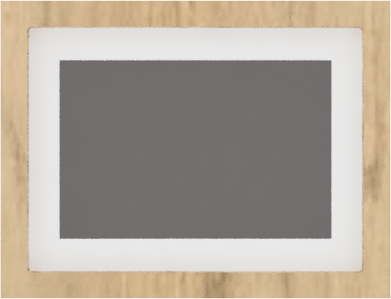
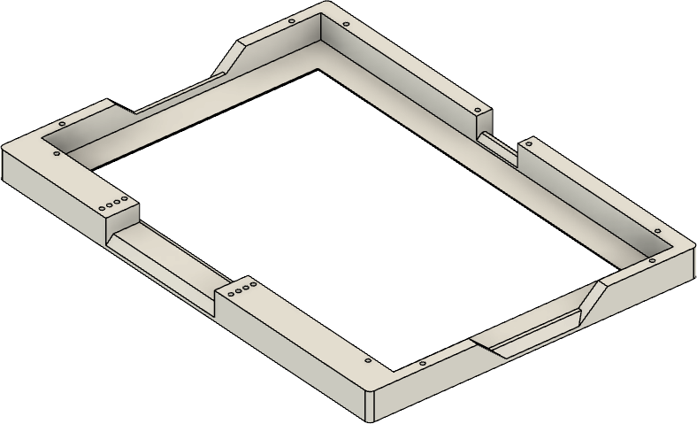
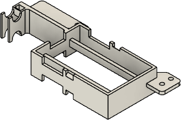

# ePaper frame for ESPhome

A 3D Printed picture frame for ESP32 to be used e.g. with ESPhome for home assistant 




## Introduction

A 3D printed picture frame, built with ESP32/ESPhome:

- A robust structure
- can be used in portrait and landscape mode
- home assistant integration
- Example code

## Electronics

| Name                       | Thumbnail                                                                | Required          | Note      |
| -------------------------- | ------------------------------------------------------------------------ | ----------------- | --------- |
| ESP32 Dev Module           |                   | 1                 |           |
| 7,5" ePaper Display HAT    |   | 1                 |           |


### ESP pinout to ePaper

If you use the out-of-the-box solution from waveshare based on ESP8266, this is the pinout for the display:
- Display model 50inV2alt
- SPI CLK: GPIO13
- SPI MOSI: GPIO14
- CS: GPIO15
- DC: GPIO27
- RESET: GPIO26 
- BUSY: GPIO25 (Inverted!)
  

### Connection Diagram

See waveshare's wiki: https://www.waveshare.com/wiki/7.5inch_e-Paper_HAT_(B)_Manual#ESP32.2F8266

## Assembly


### 3D-Printed Parts

| Filename       | Thumbnail                                                                                   | Required |
| -------------- | ------------------------------------------------------------------------------------------- | -------- |
| frame             |                          | 1        |
| display_backplate |  | 1        |
| esp_box           |                      | 1        |
| display_cable_box |  | 1        |
| short_grid        |                | optional, required for wall hanging in portrait mode |
| long_grid         |                  | option, required for wall hanging in landscape mode |

#### Required screws

| Name      | Spec    | Required |
| --------- | ------- | -------- |
| Screw     | M2 6mm  | 4        |
| Screw     | M2 10mm | 14       |

## ESP home yaml


Source code is under `./src_esphome` and is separated into packages in `./src_esphome/packages`

- `epaper_display.yaml`: main file for ESP home configuration
- `packages/device_basics.yaml`: Basic and hardware related configuration for ESP home. No business logic
- `packages/standard_fonts.yaml`: Loads required fonts and glyphs/icons 


## home assistant configuration

In the example we use weather data provided which need to be provided in a suitable format to sensors in ESP home devices. 
For this, we need to modify configuration.yaml in order to query data and feed it into the right format in entities.

Source code is under `./src_homeassistant`.

- `epaper_package.yaml`: Extensions to configuration.yaml. Provided as separate package. 

Can to be included in configuration via import directive (e.g. ```yaml packages: !include_dir_named packages```)

